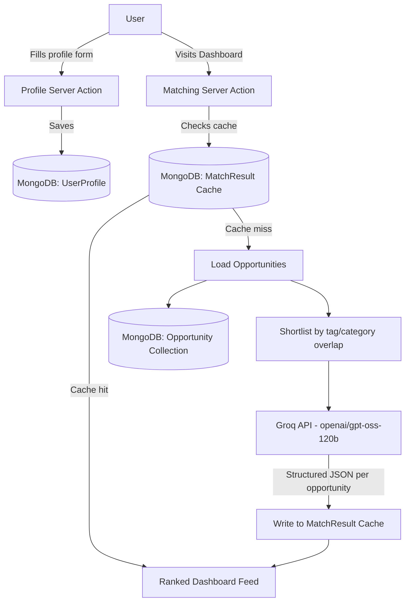

# OppFinder

**Never miss the opportunity you already qualify for.**

Built by **Threadbare** for the OpenAI × NamasteDev Hackathon.

## The Problem

Student developers are eligible for dozens of hackathons, free AI credits, subscription discounts, student programs, certifications, and open-source programs — but they miss most of them. Not because they don't qualify, but because these opportunities are scattered across Twitter, Discord, newsletters, and company blogs, with no single place that tells you: *you specifically qualify for this, and here's why.*

Example: a 3rd-year CS student with a free Microsoft exam voucher and a `.ac.in` email address is eligible for a dozen programs they've never heard of — until the deadline has already passed.

OppFinder fixes this by pairing a curated opportunity dataset with an AI agent that reasons over your actual profile against each opportunity's real eligibility criteria, and tells you why it matters right now.

## Core Features

- **Profile-based matching** — a short profile (role, year, skills, interests, student email) drives personalized results, not a generic list.
- **AI eligibility reasoning** — for each opportunity, the AI explains *why* you qualify (or what's missing), not just whether it exists.
- **Urgency scoring** — matches are ranked by a combination of deadline proximity and how closely your skills/interests fit, so the most time-sensitive, relevant opportunities surface first.
- **Six curated categories** — hackathons & competitions, AI platform free trials/credits, subscription discounts, student developer programs, certifications & exam vouchers, and open-source contribution programs.
- **Dashboard experience** — profile summary, match stats, and a ranked feed in one cohesive view, not a stitched-together set of pages.
- **Cached results** — matching runs are cached (24h) so the dashboard loads instantly after the first run, instead of re-querying the AI every visit.

## Tech Stack

- **Framework:** Next.js (App Router), React
- **Backend:** Server Actions only — no API routes, no client-side fetch
- **Database:** MongoDB (via Mongoose)
- **AI:** Groq API, `openai/gpt-oss-120b`
- **Styling:** Plain CSS with custom properties, no Tailwind, responsive with explicit mobile breakpoints
- **Deployment:** Vercel

## How the AI Matching Works

This is the core of the project, not a decorative add-on.

1. The user's saved profile and the full opportunity set are loaded from MongoDB.
2. Opportunities are pre-filtered to a relevant shortlist using lightweight tag/category overlap scoring — this keeps the AI call focused on the opportunities that actually matter for this profile.
3. Each shortlisted opportunity is sent to Groq (`openai/gpt-oss-120b`) along with the user's profile, with a prompt that asks the model to reason over the opportunity's structured eligibility criteria against the user's profile — not just summarize the listing.
4. The model returns strict structured JSON per opportunity:
   ```json
   { "opportunityId": "...", "eligible": true, "reason": "...", "urgencyScore": 1-5 }
   ```
5. Calls are throttled and batched to stay within Groq's free-tier rate limits (requests/minute and tokens/minute).
6. Results are cached in MongoDB for 24 hours, keyed to the profile, so the dashboard loads instantly on repeat visits without re-querying the AI every time.

## Architecture



## Getting Started

### Prerequisites
- Node.js 18+
- A MongoDB Atlas cluster (free tier works)
- A Groq API key ([console.groq.com](https://console.groq.com))

### Setup

```bash
git clone https://github.com/SwayamDash07/oppfinder.git
cd oppfinder
npm install
```

Create `.env.local` in the project root:

```env
GROQ_API_KEY=your_groq_key_here
MONGODB_URI=your_mongodb_atlas_connection_string_here
```

Seed the database with sample opportunities:

```bash
npm run seed
```

Run the dev server:

```bash
npm run dev
```

Visit `http://localhost:3000`.

## Roadmap / Business Perspective

The current build is intentionally scoped for the hackathon timeframe — a curated, verified dataset over a live scraping pipeline, and manual profile input over automated inference. That was a deliberate choice to keep the core AI-reasoning feature reliable and demo-ready, not a ceiling on the idea. Two clear directions for where this goes next:

- **Automated opportunity discovery.** An AI agent that continuously monitors sources (Devpost, company blogs, X/Twitter, newsletters) for new hackathons, free credits, and programs, extracts structured eligibility data, and flags it for lightweight verification before it reaches users — turning the dataset from a static seed list into a live, self-updating feed.
- **GitHub-based profile enrichment.** For users who connect a GitHub username, an agent could analyze public repository activity, languages, and contribution patterns to infer skills and interests automatically — reducing manual profile input and making matches more accurate over time, especially for users who undersell themselves in a form.

Both are natural extensions of the same core idea: eligibility matching should require zero manual effort from the user, on both the data side and the profile side.

## Team

**Threadbare** — Swayam Dash

Built as students still learning the ropes of full-stack and AI, using this hackathon as a chance to build something real, make mistakes, and get better at shipping.